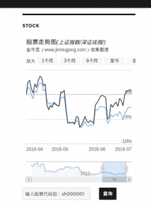

好久没发东西了，上班已经快一个月了。没想到之前随便搜索到并且使用的wordpress，在工作之后也可以用到。

工作使得我从对wordpress一窍不通，只会简单的使用，甚至插件之类的都不能熟练使用，到现在为其开发一个简单的小插件，经历蛮多的。

本来也不是专业的人，在这里如果讲一些对wp的理解显得不太好，不开发插件的人也没必要看懂。

<!--more-->

开发过程还是相对比较顺利的，因为是一个非常简单的插件，我觉得更加得益于wp插件的开源，使得我看英文文档的时候能够结合一些插件源码来学习，我觉得对我提高很大。其中要吐槽的一点，好像wp的网站有时会被墙，我真是服了，还碰到了一些前段技术网站也被墙，还是挺火大的，但是这又有什么用……

扯得有点远，非常遗憾，我这款主题主页没有widget，而我的插件是生成widget，所以没法在我网站看到了。这里留一个我的测试服务器链接，有兴趣可以过去看看，就是主页右边显示股票走势的部分。

服务器换了个没有wigdit的主题，所以也就没法预览了。
