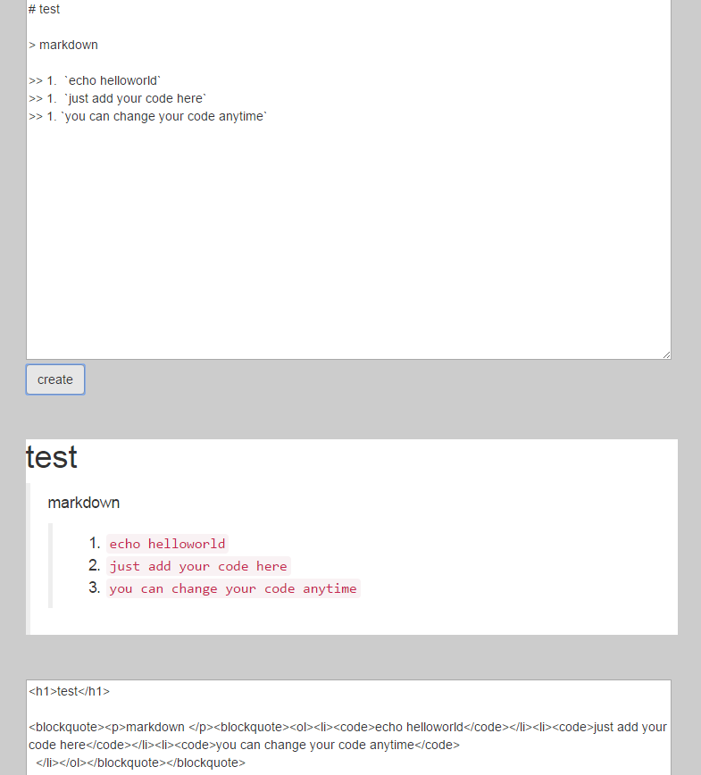

<h3>关于  <a href="https://zh.wikipedia.org/wiki/Markdown">markdown</a></h3>

<blockquote><ul><li>markdown 是一种轻量级的 <em>[ 标记语言 ]</em>  </li><li><em> 简书</em> 上的一篇入门指南写的很好：<a href="http://www.jianshu.com/p/1e402922ee32/">Markdown——入门指南</a></li><li>markdown 根据自己语法定义的标识符将文章转化为 <em>html</em> 标签</li><li>wordpress 编辑文章时可以将markdown生成的html标签写进去，前提是你放弃可视化编辑</li></ul></blockquote>

<!--more-->

<h3>我做的 <a href="https://zcong1993.github.io/markdownEditor/">markdownEditor插件</a></h3>

<blockquote><ul><li>点击上面链接可以进入在线编辑页面</li><li>上面的输入框里面，你可以写自己的markdown文章</li><li>中间部分会将你输入的内容 <em> 实时解析 </em>为最终显示出来的效果</li><li>当你编辑完成后，点击 <code>create</code> 按钮，最底下就会生成相应的Html标签</li><li><code>复制</code> 内容粘贴到任何支持<code>html</code>标签的地方就能正常显示了</li></ul></blockquote>

<blockquote>
markdown主要是可以用非常简洁的语法做出很漂亮干净的页面，我个人还是比较喜欢的。当然也有专门编辑markdown的软件，我这个页面也比较简陋。单纯的为了方便编辑WordPress文章做的。我非常讨厌WordPress的可视化编辑。
      
</blockquote>

