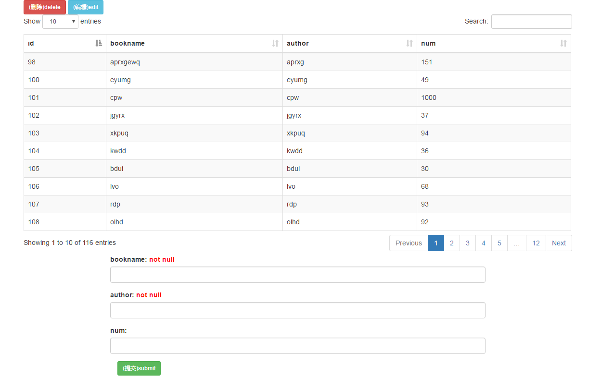

### DB_admin

#### 目录结构

```
server---&gt;				#服务端文件，需要放在能够操作数据库的服务器
		DB.php			#pdo操作数据库的核心文件
		db_api.php		#DB_admin为http请求做的缓冲层
index.html				#DB_admin前台管理界面
src---&gt;					#前台管理页面需要的文件
		css				#前台需要引入的css文件
		js				#前台需要引入的js文件
```

<!--more-->

#### 基本配置

  -  server端数据库链接配置，`DB.php`文件

```php
static private $dbConfig = array(
        'host'      => '127.0.0.1',     #地址
        'username'  => 'zcong',         #用户名
        'passwd'    => '****',        #密码
        'database'  => 'zctest',        #启用数据库名称
        'type'      => 'mysql',         #数据库类型，默认
        'port'      => 3306             #端口号，默认
    );
```
- 前端展现层请求配置，`src/js/main.js`

```js
var TABLE_NAME = 'book';							#需要操作的表名
var URL = 'http://example.com/db_api.php';	#server入口文件的url请求地址
```
#### 基本原理

- 同时启用`前后台`
前台界面层与用户交互，通过js请求server端，然后通过PDO操作数据库。前台通过`dataTables`生成数据库数据表格，支持**排序，搜索**操作，下面部分生成表单供**添加，更新数据**使用，根据数据库字段动态生成字段类型**不为text**则显示为`input`输入框，`text`显示为`textarea`，如果数据库中字段**NOT NULL，不为主键且没有DEFAULT值**，则输入框为**必填**选项，为空时表单无法提交；
- 只启用`server`端
可以通过`HTTP`请求操作数据库相关`api`见下文；
- 只启用`server`端，`DB.php`文件
相当于只启用核心`PDO`层，可通过`php`方法操作数据库，相关`api`见下文。

#### 模式详解

- 完整模式



如上图，配置好数据库连接和js地址之后，可对数据表进行增、删、改、查操作。表格会显示数据表中的所有数据，默认页面显示为10条，可以自行调整，每个字段名称点击可以排序。
  - 插入数据
    数据表下面会动态生成表单，会根据`mysql`中的数据是否允许为空限制插入数据是否可以为空(**注意：**如果数据有`default值且部位null，或者是主键autoincreament则允许为空`)。留空时，若字段有默认值则为默认值，否则为空，NOT NULL时则不允许提交数据。若强行修改前端代码，后端也会限制；
  - 删除数据
  	删除数据需要选中一条数据，点击数据会选择一条数据，然后点击`delete`会删除相应数据，(**注意：**删除数据没有**二次确认**，请谨慎操作)。删除完成后表单会自动局部刷新；
  - 编辑(更新)数据
  	更新数据和删除数据一样，需要选中一条数据，然后点击`eidt`，此条数据会显示在底下的表单中作为默认值，和上面插入数据一样会限制数据是否能够为空。(**注意：**更新操作若想使用默认值请务必手动填写，更新操作没法添加default值，为空时若字段允许为空则生效，否则会过滤掉，也就是不做更新操作。)

- HTTP请求模式（api）

>- 请求入口文件(db_api.php)
```js
method 方法：
		get_meta			#查询数据表结构，返回字段名、类型、是否允许空，是否有default值，是否为主键
    	find_all			#获取记录所有字段，相当于 select *
    	find					#获取自定义字段
    	insert				#插入数据
    	update				#更新数据
    	delete				#删除数据
```
>- 返回值类型格式
	`{"code":200,"msg":"find_all success","data":data }`,`code`为状态码,`msg`为提示信息,`data`为真正返回的数据。
>- 状态码
```php
200 success         成功，注： 某些方法成功与否还得自己判断，比如重复删除一条记录，都会返回成功，data为1才是真正的成功，0是空操作。
300 insert error    插入数据失败,data数据不符合规范
301 delete error    删除数据key参数只能是数字
302 table error     表名错误，表不存在
400 para error      url地址参数错误
401 mysql error     mysql连接失败
402 method error    method不合法
```
- 基本操作(method)

>>- get_meta 获取表结构
```js
url: http://example.com/db_api.php?table_name=<表名>&method=<方法>
参数：table_name 表名(必须) method 方法(必须)
返回值：object,key(字段名):value(text|textarea)暂时只有两种，text表示['int','tinyint','float','char','varchar','bool','date']中的类型，可以直接用input显示，而textarea则表示建议使用textarea显示
例子：http://example.com/db_api.php?table_name=text&method=get_meta
```
>>- find_all 查询全部字段
```js
url: http://example.comexample.comexample.com/db_api.php?table_name=<表名>&method=<方法>&limit=<长度>&where=<条件>&order=<排序>&desc=<是否降序排序>
    参数: table_name 表名(必须) method 方法(必须)
        	limit 长度(选填),默认为所有,<1 的值相当于查询所有
        	where 条件(选填),默认为空,格式为{条件1,条件2...}默认以&&连接
        	order 排序(选填),默认为空
        	desc  是否降序排序，默认为false，只有order存在时生效
    例子:http://example.com/db_api.php?table_name=book&method=find_all&limit=100&where={id>2,id<150}&order=id&desc=1
```

>>- find 查询部分字段(**注意由于前端界面依赖主键，所以无论如何请把主键加上且放在第一位！！！！**)
```js
url: http://example.com/db_api.php?table_name=<表名>&method=<方法>&keys=<字段>&limit=<长度>&where=<条件>&order=<排序>&desc=<是否降序排序>
    参数：keys 字段名(必须),格式为{字段1,字段2...},单一字段可不用写{},注意最终数据会以参数中的字段顺序显示。
        其他部分同上
    例子: http://example.com/db_api.php?table_name=book&method=find&keys={num,id}&limit=100&where={id>2,id<150}&order=id&desc=1
```
>>- insert 插入一条记录
```js
GET方式：
    url: http://example.com/db_api.php?table_name=<表名>&method=<方法>&data=<数据>
    参数: data 插入的数据(必须),格式{字段名1:数据1,字段名2:数据2...}
        其他部分同上
    例子: http://example.com/db_api.php?table_name=book&method=insert&data={bookname:zc111,author:zc,num:2}
POST方式：
    url: http://example.com/db_api.php?method=insert
    参数：data 插入数据（必须），格式为{"name":"zc","age":23},也就是object形式
        table_name 表名（必须），string类型
```
>>- update 更新一条记录
```js
GET方式：
    url: http://example.com/db_api.php?table_name=<表名>&method=<方法>&data=<数据>&key=<条件中的键>&value=<条件中的值>
    参数；data 更新的数据(必须),格式{字段名1:数据1,字段名2:数据2...}
        key 执行条件中的键(必须)
        value 执行条件中的值(必须)
    例子: http://example.com/db_api.php?table_name=book&method=update&data={bookname:zc222}&key=id&value=208
POST方式：
    url: http://example.com/db_api.php?method=update
    参数：data 插入数据（必须），格式为{"name":"zc","age":23},也就是object形式
        table_name 表名（必须），string类型
        key 执行条件中的键(必须),string类型，建议使用主键
        value 执行条件中的值(必须),string|int类型
```
>>- delete 删除一条数据
```js
url: http://example.com/db_api.php?table_name=<表名>&method=<方法>&key=<删除信息的主键id值>
    参数: key 主键id值(必须)
        其他同上
    例子：http://example.com/db_api.php?table_name=book&method=delete&key=208
```

- PDO模式(php当做库调用)
>- 请求文件(DB.php)
```php
function 函数：
getTables				#获取当前数据库的所有数据表名称
getMeta				  #获取数据表结构
findAll				  #获取所有字段
find					 #获取自定义字段
insertData			   #插入一条数据
update				   #更新一条数据
delete				   #删除一条数据
```
>- 基本操作(function)

>>- function getTables()获取当前数据库中的表名
```php
参数：无
返回值：array,表名数组
```
>>- function getMeta() 获取数据表结构
```php
function getMeta($table_name,$trans=1){}
参数：$table_name string 必须 数据表名称
			$trans int 默认值为1 是否转义* 默认转义
返回值:array(
		"name"=>字段名
		"type"=>字段类型 *
		"allow_null"=>是否允许空 YES||NO
		"default"=>默认值，无则为""
		"extra"=>额外属性,如主键的 autoincreament
		)
异常: 如果$table_name不存在会抛出异常 throw new Exception('table not exists');
*转义: 数据库字段长短不一，动态生成编辑表单时存在选择input还是textarea的问题，所以转义会把/int|char|double|date|timestamp/这些比较短的数据类型直接转为text，text则转为textarea,可以根据返回值生成表单格式。
```
>>- function findAll()获取所有字段
```php
function findAll($table_name, $limit=0, $where=array(),$order='',$desc=false){}
参数：$table_name string 必须 数据表名
			$limit	int 默认值0(返回所有结果)  返回结果条数,小于1时，无意义，当做返回所有对待
			$where  array 默认值为空   筛选条件，例如 array('id>2','id<5')默认且只支持&&连接
			$order  string 默认为空    排序依据字段名
			$desc   bool  默认为false  是否倒序排序，如果$order参数没设置则不会生效
返回值：$res  array 结果数组PDO::FETCH_ASSOC
异常: 如果$table_name不存在会抛出异常 throw new Exception('table not exists');
```
>>- function find() 获取部分字段
```php
function find($table_name, $keys, $limit=0, $where=array(),$order='',$desc=false){}
参数： $table_name string 必须 数据表名
			$keys   array||string 必须 获取字段名，1个字段时可以直接传入string,多个数据需要array('id','name')
			$limit	int 默认值0(返回所有结果)  返回结果条数,小于1时，无意义，当做返回所有对待
			$where  array 默认值为空   筛选条件，例如 array('id>2','id<5')默认且只支持&&连接
			$order  string 默认为空    排序依据字段名
			$desc   bool  默认为false  是否倒序排序，如果$order参数没设置则不会生效
返回值：$res  array 结果数组PDO::FETCH_ASSOC，参数错误时，返回为空
异常: 如果$table_name不存在会抛出异常 throw new Exception('table not exists');
```
>>- function insertData() 插入一条数据
```php
function insertData($table_name, $data){}
参数：$table_name string 必须 数据表名
			$data  array  必须  插入的数据 array('name'=>'name','num'=>111)
返回值: $lastInsertID 成功返回插入id(主键)，失败返回空
异常： NOT NULL字段(且default值为null且非主键)插入空值时抛出异常 throw new Exception("check your data");
```
>>- function update() 更新一条数据
```php
function update($table_name, $data, $key , $value){}
参数：$table_name string 必须 数据表名
			$data  array  必须 需要更新的数据 array('name'=>'name','num'=>111)
			$key  string  必须 更新条件中的额键，一般为id(主键)
			$value string 必须 更新条件中的值，一般为主键id的值
返回值：成功返回1，失败返回空
异常：NOT NULL字段(且default值为null且非主键)插入空值时抛出异常 throw new Exception("check your data");
```
>>- function delete() 删除一条数据
```php
function delete($table_name, $id){}
参数： $table_name string 必须 数据表名
			$id    int       必须   主键id的值，不是数字时返回false
返回值：成功返回影响条数1，失败返回false
````
