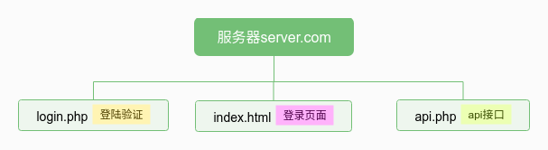
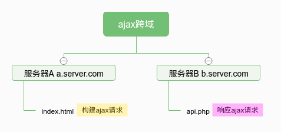
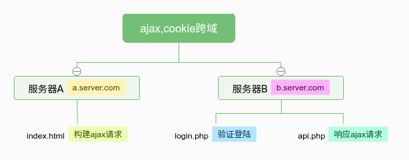

***

  学习php开发的人绝对接触过或者写过简单的登陆验证程序，这是非常典型且基本的php+html+db的操作案例，我们就从简单的登陆说起吧。

<!--more-->

#### 简单的登陆程序



上图这种目录结构就是最简单的形式。`index.html`用来与用户交互，`login.php`则作为验证判断登陆的逻辑程序（通过读写cookie，session），`api.php`用来相应页面的请求返回相应的数据（如数据库数据）。

主要逻辑：用户通过登陆页面登陆将用户名和密码post到`login.php`页面，验证页面验证用户信息，匹配成功写入相应的cookie和session。使用api接口请求数据时，通过cookie或者session就可以验证用户权限做出相应操作。

一切就是这么顺利，登陆表单通过post提交数据，页面通过ajax请求获取数据（局部刷新对用户比较友好）。主要因为甚至同一个目录底下。

#### ajax请求跨域问题





可以看到A服务器向B服务器发了一个ajax请求，简单代码如下:
```html
//index.html 默认已经引入jquery
<script>
  $.ajax({
      type: 'GET',
      url: 'http://b.server.com/api.php'
      dataType: 'json',
      success: function(data){
          console.log(data)
          alert('success')
      }
  })
</script>
```

```php
//api.php
<?php
  echo json_encode('ajax response!');
?>
```

此时A服务器发起请求的时候就会报错：`Access-Control-Allow-Origin:`not allow a.server.com，简单的理解就是A服务器不在请求白名单中。所以我们需要在`api.php`将a服务器域名加进去。
```php
//api.php
<?php
  header('Access-Control-Allow-Origin: http://a.server.com');
  echo json_encode('ajax response!');
?>
```
此时请求就会成功。将`http://a.server.com`换成 * 就是允许所有域名请求。

其实ajax请求如果跨域，是验证请求header中的`HTTP_ORIGIN`属性是否在白名单内，假如我们需要允许多个服务器域名，`api.php`可以这样写：
```php
//api.php
<?php
  $ALLOW_ORIGIN = array(
    'http://a.server.com',
    'http://c.server.com'
  );
  $origin = isset($_SERVER['HTTP_ORIGIN'])?$_SERVER['HTTP_ORIGIN']:'';
  if(in_array($origin,$ALLOW_ORIGIN)){
    header('Access-Control-Allow-Origin: '.$origin);
  }
  echo json_encode('ajax response!');
?>
```
跨域问题解决了，假如你的领导让你实现一个登陆程序，然而他非要让你把`index.html`文件部署在A服务器，把`login.php`和`api.php`部署在B服务器，这便迎来了我们另一个问题。

#### ajax跨域cookie问题

如果是第一种简单的程序，我们的`login.php`可以简单地写成这样：
```php
//login.php
<?php
  $username = $_POST['username'];  //index.html post过来的用户名
  $passwd = $_POST['passwd'];      //密码
  if($username=='admin'&&$passwd=='admin'){
    setcookie('user','login',time()+300);   //验证成功写入300秒后过期的cookie
  }
?>
```


我们的`api.php`这样写：
```php
//api.php
<?php
  header('Access-Control-Allow-Origin: http://a.server.com');
  $user = isset($_COOKIE['user'])?$_COOKIE['user']:'';
  if($user=='login'){
    echo json_encode('ajax response!');   //cookie中user是设定值时返回数据
  }
?>
```
我们通过A服务器构建ajax请求，验证通过login.php会在`b.server.com`这个域的cookie中写入一条，然后请求api时，`api.php`会验证本域下cookie的正确性判断是否响应。

这样做在第一种情况完全没问题，可是在我们这种情况ajax请求是不会返回数据的,因为跨域ajax请求时，cookie信息会丢失，response头不会携带cookie，而且在本例中的表现为不会处罚验证cookie那条php代码，要解决这个问题我们需要做如下处理：
```html
//index.html 默认已经引入jquery
<script>
  $.ajax({
      type: 'GET',
      url: 'http://b.server.com/api.php'
      dataType: 'json',
      xhrFields: {
            withCredentials: true   //允许携带cookie
        },
      crossDomain: true,            //跨域
      success: function(data){
          console.log(data)
          alert('success')
      }
  })
</script>
```
```php
//api.php
<?php
  header("Access-Control-Allow-Credentials: true");  //注意Access-Control-Allow-Credentials属性为true时，Access-Control-Allow-Origin属性不能为*
  header('Access-Control-Allow-Origin: http://a.server.com');
  $user = isset($_COOKIE['user'])?$_COOKIE['user']:'';
  if($user=='login'){
    echo json_encode('ajax response!');   //cookie中user是设定值时返回数据
  }
?>
```
这样我们就解决了跨域cookie问题。
