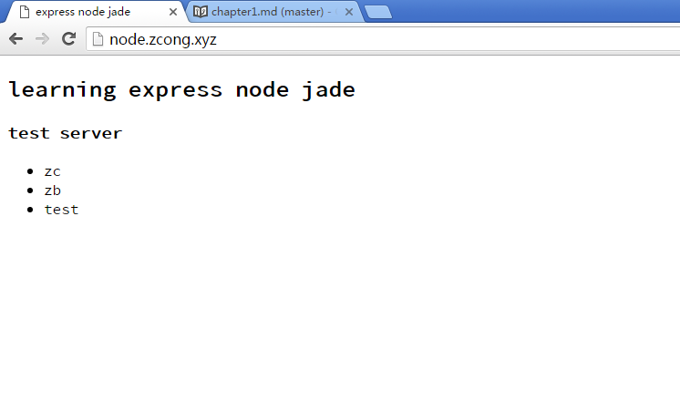

##### 将node服务非80端口的程序映射到一个二级或一级域名

***

最近在尝试着用node作为后端服务。由于服务器还装有Apache，默认端口80被占用，虽然node可以将服务器启动在任意端口，这样可以用域名加端口号访问，但是还是不太方便，于是就想到了用代理解决这个问题。

<!--more-->

***

###### 开启 **mod_proxy** 模块

这个模块默认已经安装了，我们可以在目录`/etc/apache2/mods-availiable`中查看，确实是存在的，所以我们启用它就行。
```sh
#ubuntu/debian
$a2enmod proxy_http
```
我们也知道模块启用相当于在`mods-enabled`中将相应的模块从`mods-availiable`中以软链接的形式引入过来，所以也可以手动完成:
```sh
$cd /etc/apache2/mods_enabled
$ln -s ../mods-availiable/proxy.load ./
$ln -s ../mods-availiable/proxy.conf ./
$ln -s ../mods-availiable/proxy_http.load ./
$service apache2 restart
```

###### 配置虚拟host

虚拟host需要在`/etc/apache2/sites-availiable`中配置，然后在`/etc/apache2/sites-enabled`中增加软链接，Apache2会把此目录下的所有`*.conf`配置加载。

```sh
$cd /etc/apache2/sites-availiable
$vim node.conf
```
node.conf
```
&lt;VirtualHost *:80&gt;

	ServerName node.zcong.xyz                          #我们要映射的域名

	ProxyRequests Off
	ProxyVia Off

	&lt;Proxy *&gt;
	    Require all granted
	&lt;/Proxy&gt;

	ProxyPass / http://localhost:3000                  #将本机3000端口根目录
	ProxyPassReverse / http://localhost:3000           #映射到此域名根目录

	ErrorLog /var/log/apache2/node/error.log
	CustomLog /var/log/apache2/node/access.log combined

&lt;/VirtualHost&gt;
```
建立软链接
```sh
$cd /etc/apache2/sites-enabled
$ln -s ../sites-availiable/node.conf ./
$service apache2 restart
```

此时就可以测试一下：

1. 直接访问这个域名会出现`503 Service Unavailable`，因为我们没有开服务3000端口没有东西；
2. 打开服务，用node起一个3000端口的服务，访问域名便和访问`zcong.xyz:3000`的结果一样。


