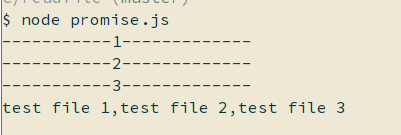

> [范例源码地址](https://github.com/zcong1993/promise-generator-async)(比较混乱，抱歉)

> [GitBook排版更好](https://zcong.gitbooks.io/zc-webapp/content/promise-generator-asyncawait.html)

<!--more-->
---

### 认识Promise对象

> Promise 对象是一个返回值的代理，这个返回值在promise对象创建时未必已知。它允许你为异步操作的成功或失败指定处理方法。 这使得异步方法可以像同步方法那样返回值：异步方法会返回一个包含了原返回值的 promise 对象来替代原返回值。（引用自[MDN](https://developer.mozilla.org/zh-CN/docs/Web/JavaScript/Reference/Global_Objects/Promise)）

Promise 对象的生命周期只有 3 种状态：

* pending: 初始状态，也就是异步请求得到结果之前的状态

* fulfilled: 成功时的状态；

* rejected: 失败时的状态.

`Promise`对象状态只能从`pending`转化为`fulfilled`或者`rejected`，并且状态一旦改变将无法再转变为别的状态，因此我们可以为`fulfilled`或者`rejected`状态分别设置相应的处理函数实现链式调用而不是函数嵌套。

`Chrome,Firefox,Edge,Opera,Safari`新版本均已支持，由于浏览器中的使用方法和`nodejs`中的基本相同，所以我们`demo`大都使用`nodejs`演示。

---

### 基本用法

> 我们以`nodejs`中异步读取文件为例演示一下`Promise`对象由定义到使用的方式。

1. 首先实例化一个`Promise`对象：
``` js
const fs = require('fs')
//定义一个readFileAsync函数
let readFileAsync = function(file) {
    //直接返回一个Promise对象
    return new Promise(function(resolve, reject) {
     //使用readFile函数
     fs.readFile(file, (err, data) => {
        //如果有错误传给reject
     if (err) reject(err);
        //成功时，用resolve将结果传递下去
         resolve(data);
       });
     z});
}
```
2. 使用`eadFileAsync`处理异步：
``` js
//由于then出来的data已经是一个buffer数据而不再是promise对象，所以不用再往下then操作
readFileAsync(file).then((data) => {
    //处理成功时读取到文件的data
 console.log(data.toString());
}).catch((err) => {
    //处理reject抛出的异常
 console.log(err.message)
});
```

由于异步函数得到结果有延迟，所以如果后续需要对异步结果进行处理，则需要把后续作为成功或者失败时的回调函数使用，这样如果几个异步结合使用代码就会混乱不堪，`Promise`就解决了这一问题，接着我们看看高级一点的使用方法。

---

### 多个异步请求结合使用

> 以`nodejs`中的`fetch`请求为例(`fetch()`本身就是一个`Promise`对象，所以直接可以用`.then()`方法)：

``` js
const fetch = require('node-fetch');
const url = 'https://api.github.com/users/zcong1993';
//使用fetch通过get请求请求url
fetch(url)
    //fetch请求的结果的.json()返回的依然是Promise对象
 .then((res) => res.json())
    //将得到的json数据输出
 .then((data) => {
     console.log(data)
 }).catch((err) => {
     //处理reject抛出的异常
    console.log(err.message)
 });
```

多个异步请求也能非常方便得写成链式，代码就变得非常清晰了。

---

### Promoise.resolve()处理异步

> 对于某些基本不出错的请求，我们可以非常简单的使用`Promoise.resolve()`来处理。例如使用`jquery`中的`ajax`请求时，一般来说除了网络异常之外都会算`success`，是否成功需要我们自己判断，所以，如果嵌套使用`ajax`请求就会比较麻烦，`Promise`可以帮我们解决这一点：

``` js
    $(function(){
        //通过Promoise.resolve()方法get请求api得到数据
        Promise.resolve($.get('https://api.github.com/users/zcong1993'))
            //将得到的数据通过post请求发送给另一个url
            .then(res => $.post('http://zcong.win/api/ajax.php', res))
            //处理得到的结果
            .then(res => {
                console.log(res)
            })
    })
```

---

### Promise.all()并发处理多个请求

> 既然是异步请求，如果不做并发基本没太大用途，接着我们使用`Promoise.resolve()`方法同时读取多个文件试试：

``` js
const fs = require('fs');
//定义一个新的Promise对象
var readFileAsync = function(file) {
    //    打印出正在读取的文件名
 console.log(`-----------${file}-------------`);
 return new Promise(function(resolve, reject) {
     fs.readFile(file, (err, data) => {
     if (err) reject(err);
         resolve(data);
     });
 });
};
//读取的文件
let file = './1.txt';
let file1 = './2.txt';
let file2 = './3.txt';
//并行执行3个读文件操作，传入一个数组，数组中每个元素都是Promise对象
Promise.all([
 readFileAsync(file),
 readFileAsync(file1),
 readFileAsync(file2)
]).then((data) => {
 console.log(data.toString());
}).catch((err) => {
 console.log(err.message)
});
```

运行结果如下：



可以看到，函数同时被执行了 3 次，之后结果都被输出出来了。

---

多个异步并发执行由于比较复杂，而且涉及是不是真正的异步执行等问题，所以之后会单独分出来写一篇文章。
