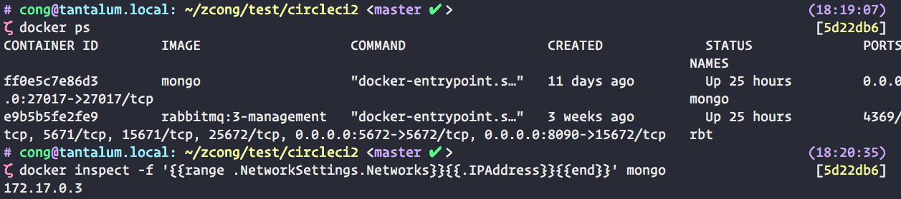
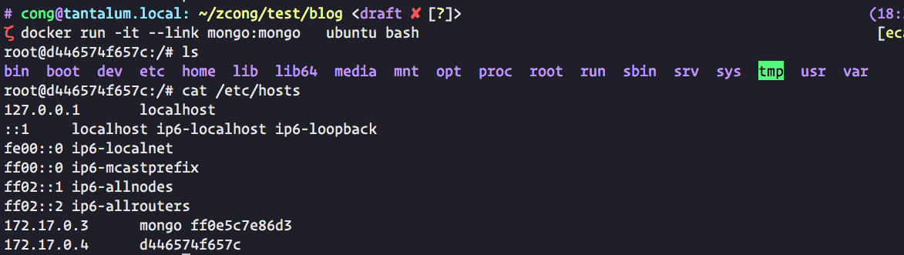

> 总感觉 docker link 很神奇, 之后发现竟然是用很简单的方法实现的.

最早接触 `docker link` 是在 `docker-compose` 配置中看到的

<!--more-->

```yaml
web:
  links:
   - db
```
`web`容器就能直接访问 `db` 容器中的端口了, `db` 容器都不用暴露相应的端口, 显得更加安全.

## 原理

docker 每运行一个容器就会分配一个 IP 地址, 可以使用

`docker inspect -f '{{range .NetworkSettings.Networks}}{{.IPAddress}}{{end}}' NAME`

查看, 例如:


可以看到, `172.17.0.3` 就是 `mongo` 容器的 ip 地址.

我们使用 link 启动另一个容器.

```sh
$ docker run -it --link mongo:mongo ubuntu bash
$ cat /etc/hosts
```


可以看到 `hosts` 中有一条 `172.17.0.3	mongo ff0e5c7e86d3`, 所以在此容器中, 使用 `mongo` 就可以访问到 `172.17.0.3`, 所以容器中 `mongo:27017`就可以连接到 mongo 容器中的 mongodb 服务.
